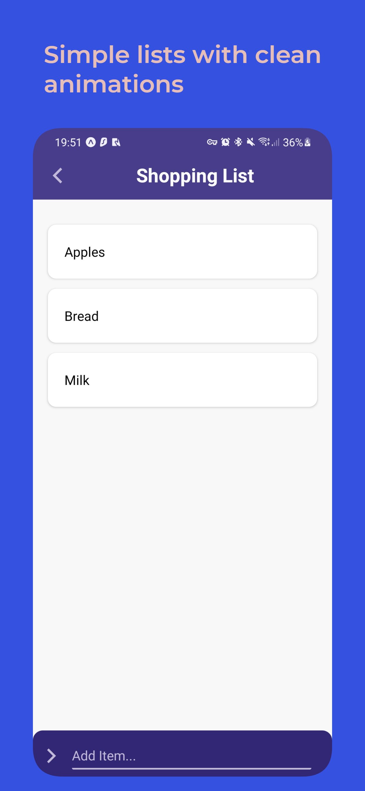

<div align="center">
  <h1> SimpleList</h1>
  <h2>A clean and simple Todo/Shopping list powered by <a href='https://github.com/software-mansion/react-native-reanimated'>Reanimated</a> 🚀
  <br/><br/></h2>
</div>

## 📥 Local installation

Download the repository and run
```
expo install
```
and
```
expo start
```

---

## 📂 Project structure

This app is a managed expo typescript project (created with `expo init`).

---

* **📁`src`:** Contains main Component (`App.tsx`), entry point of app.

  * *📄 `src/App.tsx`:* contains list items (`items`), `add-` and `deleteItem` callbacks and a basic view that wraps components from 📁`components`.

---

* **📁`components`:** Contains components that are used in main `App.tsx`.

  * *📄 `components/Header.tsx`:* Simple header on top of app, displays name of current list (with option to return to list selection screen).

  * *📄 `components/Input.tsx`:* Used to add new items to list, input component on bottom of screen.

  * *📄`components/ListItem.tsx`:* Single item in list, can be deleted by swiping. Also contains logic for deleting item.

---
* **📁`types`:** Contains global types (mainly `Item` interface).

  * *📄`index.d.ts`:* Global types/interfaces and styles.

---
* **📁`other`:** Configuration files

  * *📄`.eslintrc.js`:* Contains eslint config for project

  * *📄`app.json`:* Defines `expo`-configuration like `entryPoint`, `jsEngine`, app name etc.


